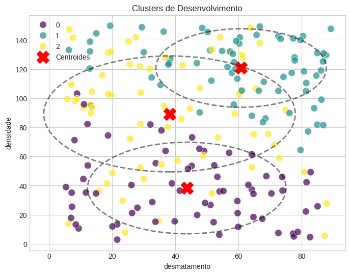
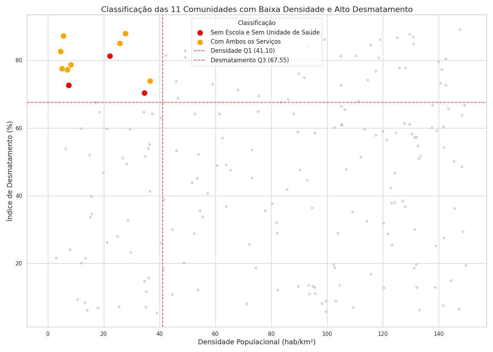
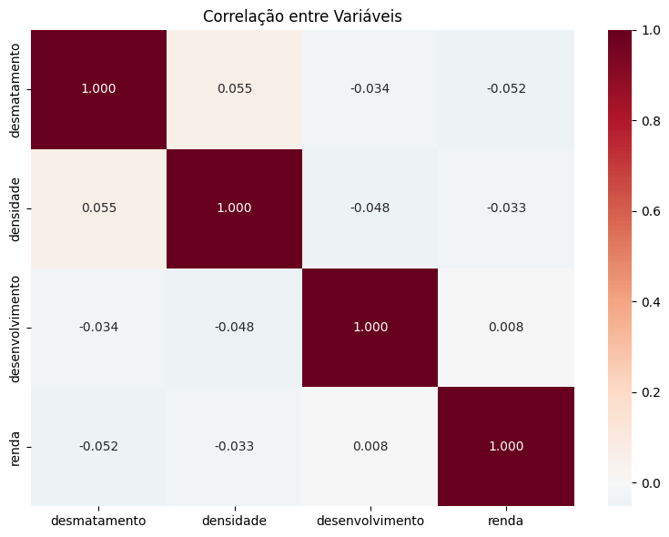

## **Análise Ambiental: Desmatamento e Desenvolvimento Social em Comunidades do Pará**

## Arquivos do Projeto

- Notebook: [Análise_Desmatamento (1).ipynb](Análise_Desmatamento%20(1).ipynb)
- Imagens: estão na pasta `/imagens`

1. Descrição:

Este projeto apresenta um relatório analítico sobre o desmatamento e o desenvolvimento social em comunidades do Pará, utilizando técnicas de inteligência artificial, como clusterização e classificação supervisionada. O estudo identifica áreas críticas caracterizadas por alto índice de desmatamento (>67,5%), baixa densidade populacional e ausência de infraestrutura básica (escolas e unidades de saúde), propondo soluções para apoiar políticas públicas e ações de mitigação.

2. Objetivo: 
Identificar padrões de risco socioambiental em comunidades do Pará.

Avaliar a relação entre desmatamento, densidade populacional e infraestrutura.

Aplicar técnicas de IA para automatizar a identificação e classificação dessas comunidades, facilitando a priorização em políticas públicas.

3. Metodologia:

Análise Exploratória de Dados (EDA): Investigação inicial das variáveis numéricas (desmatamento, densidade, desenvolvimento, renda).

Criação do Índice de Desenvolvimento: Soma binária das variáveis escola e saúde, com classificação em níveis “Baixo”, “Médio” e “Alto”.

Clusterização (K-Means): Agrupamento não supervisionado das comunidades com base em desmatamento, densidade e renda, para identificar perfis de risco semelhantes.

Classificação Supervisionada (Random Forest): Construção de modelo preditivo para os níveis de desenvolvimento social, considerando variáveis ambientais e socioeconômicas.

4. Resultados: 
Clusters Identificados: Três grupos distintos com diferentes perfis de risco socioambiental, destacando comunidades com alto desmatamento e baixo desenvolvimento.

Importância das Variáveis na Random Forest: Renda (33.8%), desmatamento (33.7%) e densidade populacional (32.5%) contribuem de forma equilibrada para a predição do desenvolvimento social.

Visualizações: Gráficos de distribuição dos índices, mapas geográficos das comunidades críticas e representações dos clusters auxiliam na compreensão espacial e estatística.

## Resultados Visuais

### Clusters Identificados
  
*Agrupamento das comunidades com perfis semelhantes de desmatamento, densidade e desenvolvimento.*

### Dispersão das Comunidades
  
*Gráfico de dispersão mostrando a relação entre densidade populacional e desmatamento nas comunidades analisadas.*

### Exemplo de Comunidade com Alto Desmatamento
  
*Imagem ilustrativa referente a uma das comunidades com alto índice de desmatamento.*

Como Usar

1. Clone o repositório:

git clone https://github.com/JaelinePina/An-lise-Ambiental.git

2. Navegue até a pasta do projeto:
 cd An-lise-Ambiental

3. Visualize os arquivos de análise (Grupo45_tarefa2_i2a2.pdf, analise_clusters.ipynb, e os gráficos na pasta /imagens).

